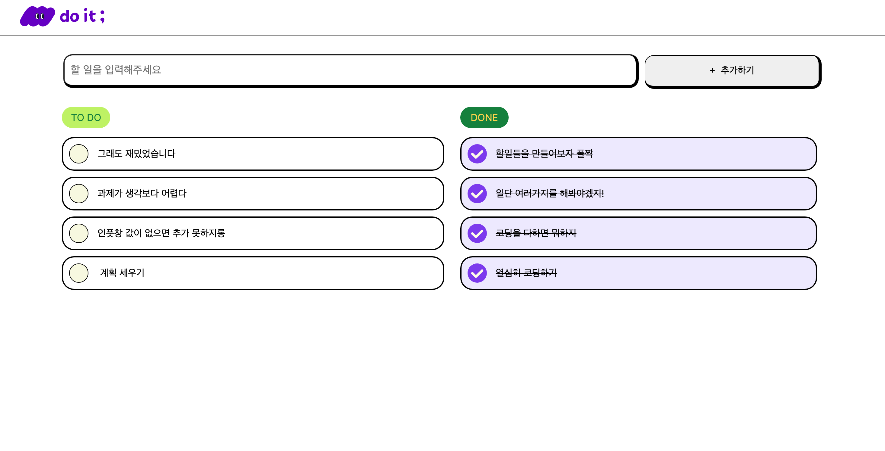
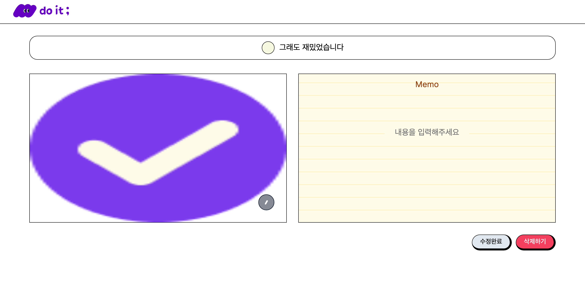

<h1>📘 ToDo-list</h1>

> ✅ 계획을 세우고 한 일을 체크하는 투두리스트

## 🚚 서비스 소개

<h3>메인 페이지</h3>

- Todo는 시작 되지 않은 일 DONE은 끝난 일을 볼 수 있습니다.
- 로고버튼을 누르면 홈으로 이동합니다.

- 상단 인풋창에 텍스트를 입력하고 엔터 또는 추가버튼을 누르면 할 일이 생성 됩니다.

- 할일 안 체크박스를 누르면 체크여부를 설정 할 수 있습니다.

- 할 일의 글자를 누르면 상세페이지로 이동합니다.

<h3>할 일 상세 페이지</h3>

- 수정기능

  - 제목,메모,사진을 기입 또는 수정 할 수 있습니다.
  - 수정을 완료하면 홈페이지는 Reload 됩니다.

- 삭제기능

  - 삭제하기 버튼을 누르면 삭제가 되고 홈으로 이동합니다.

- 사진 업로드
  - 버튼을 누르고 사진을 선택합니다.
  - 수정완료 버튼을 누르면 사진이 등록됩니다.
     
